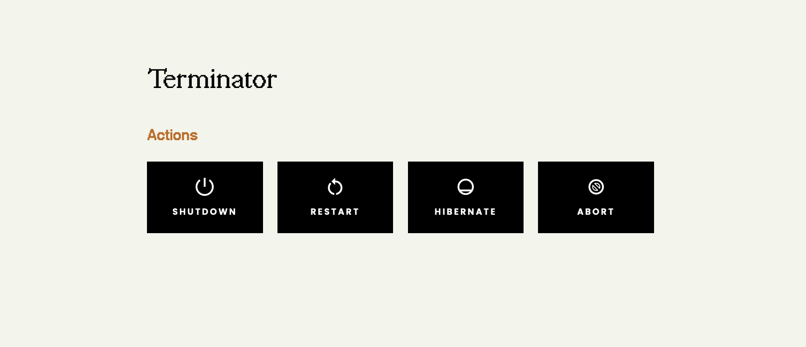
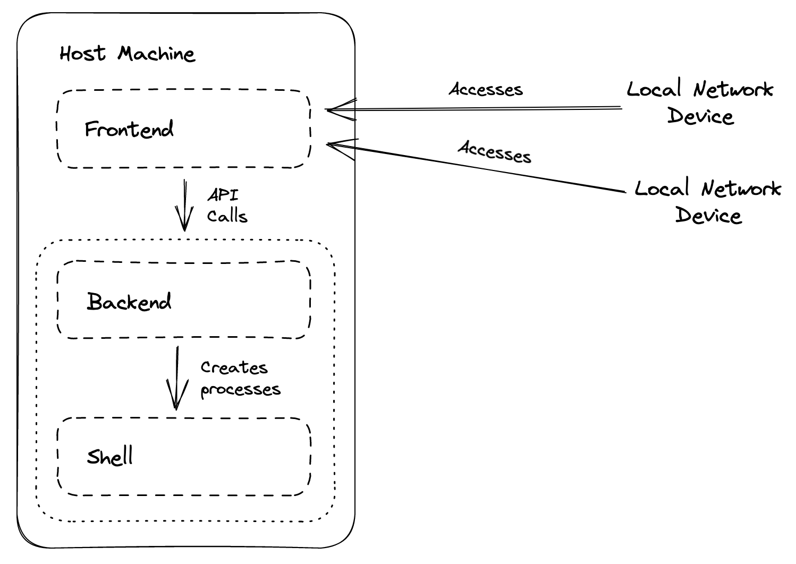

<p align="center">
    
</p>

<h1>Terminator</h1>

<details>
    <summary>Table of Contents</summary>
    <ul>
        <li>
            <a href="#about-the-project">About The Project</a>
            <ul>
                <li>
                    <a href="#built-with">Built With</a>
                </li>
                <li>
                    <a href="#architecture">Architecture</a>
                </li>
            </ul>
        </li>
        <li>
            <a href="#getting-started">Getting Started</a>
        </li>
        <li>
            <a href="#development-setup">Development Setup</a>
        </li>
        <li>
            <a href="#roadmap">Roadmap</a>
        </li>
    </ul>
</details>

## About The Project

Terminator is an application that let's you remotely shutdown, restart, or hibernate your computer from any device on your local network, using an intuitive web interface (as shown below).

<p align="center">
    
</p>

### Built With

Terminator is a full stack application, so it consists of a React frontend and Express backend. The entire codebase is written using TypeScript for the type-safety and ease of development.

[](https://yarnpkg.com/)
[](https://www.typescriptlang.org/)
[](https://react.dev/)
[](https://reactrouter.com/en/main)
[](https://expressjs.com/)

### Architecture

For the sake of this explanation, let's consider the _host device_ as the one we want to terminate, and a _local network device_ as any other device on the same local network as the host. When Terminator is started on the host computer, it will host the frontend and backend on the network its connected on.

<p align="center">
    
</p>

The backend consists of a series of HTTP endpoints, where each of the endpoints can be used to terminate the host computer either through shutdown, restart, or hibernate. The endpoints use the host device's shell to schedule termination by creating processes, so naturally the backend has a dependency on it.

The role of the frontend in Terminator is to provide an intuitive graphical user interface to the users. When an action is performed on the frontend (e.g. user wants to shutdown their computer after 30 minutes), the frontend sends HTTP requests to the backend to schedule those operations. As mentioned previously, the frontend is hosted on the local network so it can be accessed through any device (that are also on the local network) giving the ability to "remotely" terminate your host computer.

## Getting Started

To execute Terminator on your host device, follow the steps below.

1. Open your terminal and change the working directory to the project root (i.e., same level as the `packages` folder).
2. Give execution permissions to the script used to run the system, using the following command.

```sh
chmod +x scripts/run.sh
```

3. Finally, execute the system using the following command.

```sh
scripts/run.sh
```

Terminator will then locally start on Port `5556` on your host computer, and will be accessible to any device on your network.

## Development Setup

To ready the codebase for development, follow the steps below.

1. Open your terminal and change the working directory to the project root (i.e., same level as the `packages` folder).
2. Install the dependencies using the following command.

```sh
yarn
```

3. Build the `core` package using the following command.

```
yarn build:core
```

4. Run the backend in development mode using the following command.

```sh
yarn dev:server
```

5. Open another terminal window, and run the frontend in development mode using the following command.

```sh
yarn dev:client
```

The `yarn dev:server` and `yarn dev:client` both support hot reloading, so any changes in the codebase will be reflected straightaway without having to re-run the scripts.

> Note that if changes are made to the `core` package, you will need to re-run the `yarn build:core` command and possibly restart the frontend and backend.

## Roadmap

To view the roadmap for this project, visit the [wiki homepage](https://github.com/shreytailor/terminator/wiki).
